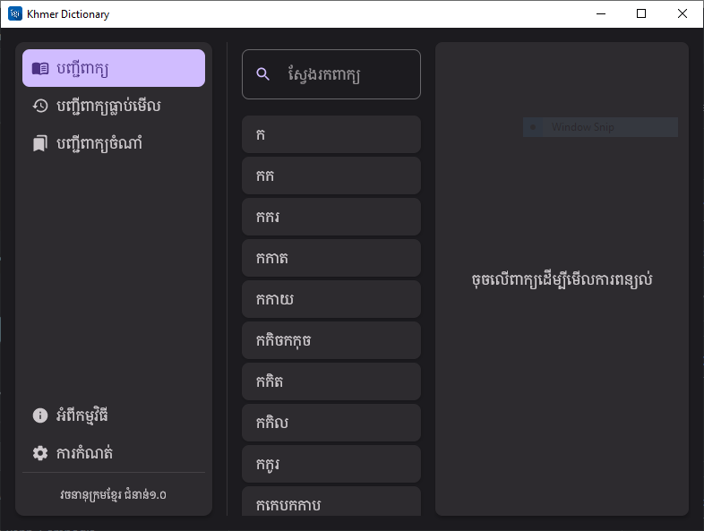
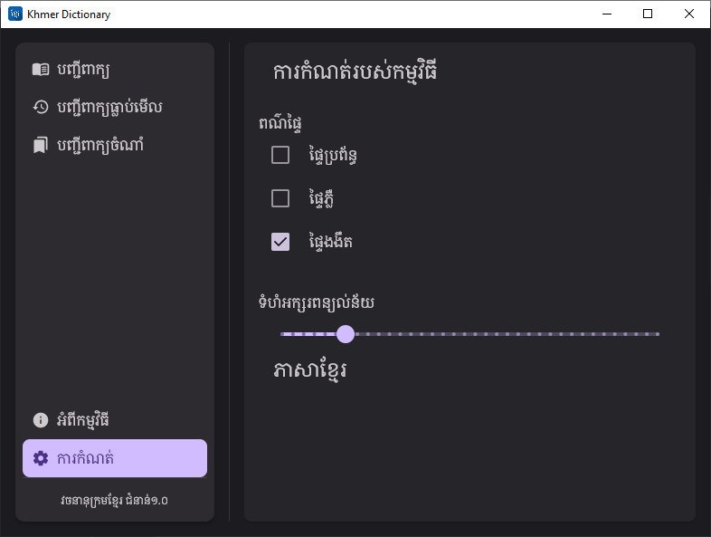
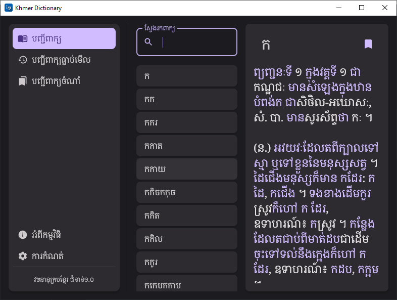

# វចនានុក្រមខ្មែរ (វចនានុក្រមសម្ដេចសង្ឃ ជួន ណាត)

This project is to showcase and to get my hand-on with Compose Desktop, by JetBrains.

There are other showcase projects of the Dictionary that I have developed. Check them out below:

[UWP](https://github.com/sovathna/UwpDictionary)

[Android](https://github.com/sovathna/Khmer-Dictionary)
# Screenshots
| បញ្ជីពាក្យ                 | ការកំណត់                   | ពន្យល់ពាក្យ                |
|----------------------------|----------------------------|----------------------------|
|  |  |  |
